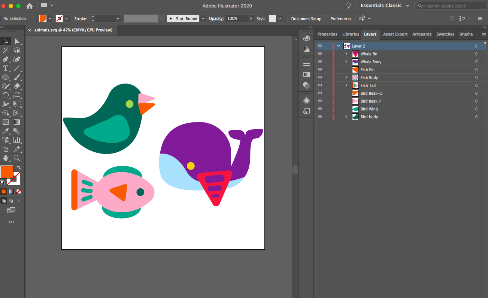
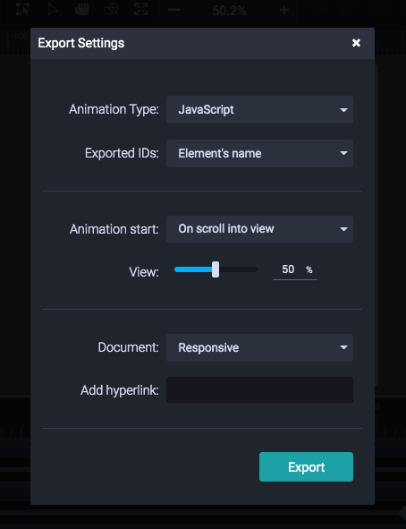

# Experimental Project: Exploring SVGs using SVGator
If you are like me then you have been getting increasingly invested in the web trend that is putting GIFs out of commision: SVGs. (check out UX Planet listed in "Additional Resources* below).

I wanted to use some background knowledge of Bootstrap's respnsive layout capabilities to build out a responsive site with __interactive and responsive SVGs__. Using the 6 days of creation as text of the website, I created Mary Blair inspired images to represent the 6 days. (See Example of Mary Blair's artwork for the creation of Disney's It's a Small World).

## SVG Creation (please note this tutorial may cost you :dollar: :dollar: :dollar:)
First off, let's talk about SVGs...

An SVG is a vector-based image format specifically for the web. An SVG is programmable, can be SEO-optimized, and will always be crystal clear (as it is a vector image).

In a lot of my research, the company [SVGator](https://www.svgator.com/) kept on popping up. I decided to check it out and discovered that it had a lot of possibilities. While I am in no way an expert on all of the capabilities that it presents, I used this project to play around with the possibilities of using interactive and scroll-based animations using javascript. I found that it works very similar to Adobe After Effects, so if you are familiar with that program at all the learning curve should be relatively quick. 

__Things To Do For This Tutorial__
* Fork my project
* Download This <code>.ai</code> [file](Links/baby.ai)
* Signup for a Premium [SVGator](https://www.svgator.com/) Account
  * SVGator comes at a price (for interactive SVG capabilities like we will use) the cost is $18 a month ($12 for annual billing). Personally, to me it is worth it as I would like to work on some upcoming personal projects over break (like my wedding website). It also does all of the heavy lifting for you, so it will condense many hours of work for you!

### Make An SVGator Account
Like I mentioned up above: there is a cost to following this tutorial. Personally, I think you get an amazing bang for your buck by using this site, but it might not be for you if you do not plan on using it afterwards. As there will be a pretty long winter break, this could be a good time to use this out and maybe implement some animation into your portfolio site or just some personal projeccts. It's a really awesome program if you plan on using it after this tutorial.

### Setting Up Files in Illustrator
**Begin by opening the illustrator file provide above in illustrator**

To make an SVG, we need to begin in Adobe Illustrator. Any <code>.ai</code> file can be saved as an <code>.svg</code> file. Changing a file to <code>.svg</code> will allow it to be programmed.

Unlike setting up the files for Adobe After Effects, you want to keep all the parts inside of one layer. Give each item or groups of items a name with in the same layer. (See image below).

Open the file <code> baby.ai </code> illustrator. Using the groups or paths that currently exist rename the parts with in the layer the following:
* <code>baby-body</code>
* <code>baby-eye-l</code> *"l" means left
* <code>baby-eye-r</code> * "r" means right
* <code>baby-hair</code>
* <code>baby-face</code>

Once this step is completed save the file as  <code>baby.svg</code>

### Creating Animation In SVGator
I thought it would be easier for you to follow along with me! Watch this tutorial I made on loom to follow along the animation process!

:movie_camera:  [Follow Along With My SVGator Animation Tutorial On Loom!](https://www.loom.com/share/4ef3976b5bee4e6a8c1b19cd18ac1645)

### Exporting SVG From SVGator
In order to create an interactive SVG on SVGator, we need to make sure that all of our export settings on SVGator are correct. We need to make sure that the animation type is set to <code>javascript</code>, the animation type is set to <code>scroll into view</code>, and the document is set to <code>responsive</code>. Verify with the with the screenshot below:

### Importing SVG Files Into Your Website

1. Let's start off by adding <code>baby.svg</code> into the <code>images</code> folder.

1. Next, we need to adjust our layout to incorporate our new image. We we utilize Bootstrap to do so (see my note at the bottom or additional information on the Bootstrap link listed below). Jump to line 103 in <code>index.html</code>. Replace the current <code>div</code> with the following class: 
<code> class="col-lg-5 col-md-5 col-sm-10 col-10 my-auto mx-auto order-1" </code>

1. At the end of the <code>p</code> ending in line 114 or 115 with the words "and there was morning—the sixth day." close the <code> div </code> out.

1. Add a new <code>div</code> immediately after with the class of':
<code>class="col-lg-5 col-md-5 col-sm-10 col-10 my-auto mx-auto order-2"</code>
Do not close this <code>div</code> because there is an extra close tag, where the old div had closed.

1. In order for your animation to work on your website we need to order some things to make it work.If we are importing an animated svg, then we can not simply add it in as an image, we need to add it in using javascript. To do this we need to add jquery into the head of our website.
<code>  </code>

1. Normally an <code>.svg</code> file can be implented with a simple <code> img </code> tag.
But since it is already programmed for javascript we need a different tag than an image tag, so we will actually add it in using an <code>object</code> tag.

1. Add <code>type="image/svg+xml" data="images/baby.svg"</code> inside open <code>object</code> tag. Close out tag.

  1. *Let's do a little bit of a break down to what this means.*
  Inside the object tag you will notice that we have following: 
* <code> type="image/svg+xml" </code>
  * the media type is an image, and the subtype is an svg and xml
* <code> data="images/baby.svg" </code> 
  * the data here will grab the codes that were programmed into the svg file that we imported in from SVGator
  
 Once you have added in the <code> object </code> element, the SVG should be up and running! Go check it out!
 
*Side Note On Making the Layout Responsive*
 
As you have noticed by now, the layout on this is responsive. When we exported out our SVG from SVGator, we made sure that we entered "responsive" on the drop-down menu. By exporting it as a reponsive image, it can size to fit into any size it is given; however, I just wanted to note that the reason that the SVGs are fitting in to this website in this particular layout is due to the constraints I have coded into it via Bootstrap. I did not cover Bootstrap in this tutorial but have found it super helpful to learn. If you would like to learn more about Bootstrap, click on the link I provided in additional resources below.

Congratulations! You have created an interactive and responsive SVG using SVGator!!!! :clap: :clap: :clap: :clap: :clap:

## Additional Resources

* [Bootstrap](https://getbootstrap.com/)
* [Smashing Magazine's Guide on SVGator](https://www.smashingmagazine.com/2018/07/animating-svg-files-svgator/)
* [UX Planet article on how/why SVGs are replacing GIFs in terms of usage](https://uxplanet.org/why-its-time-to-focus-on-svg-animations-the-story-of-svgator-ac87ff2912e2)
* [Emoji Markdown Cheatsheet (in case you are curious)](https://github.com/ikatyang/emoji-cheat-sheet/blob/master/README.md)
 
